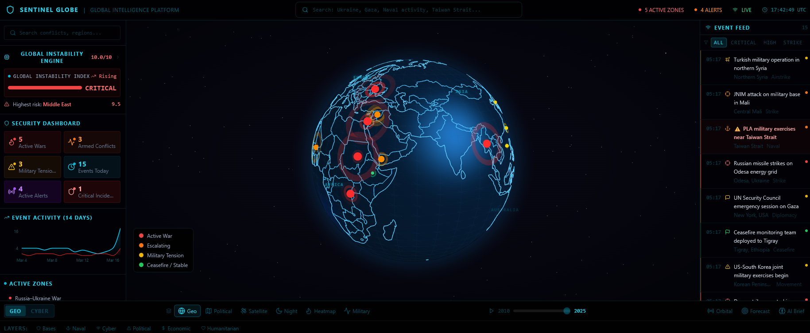
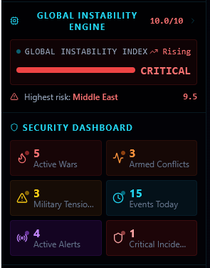
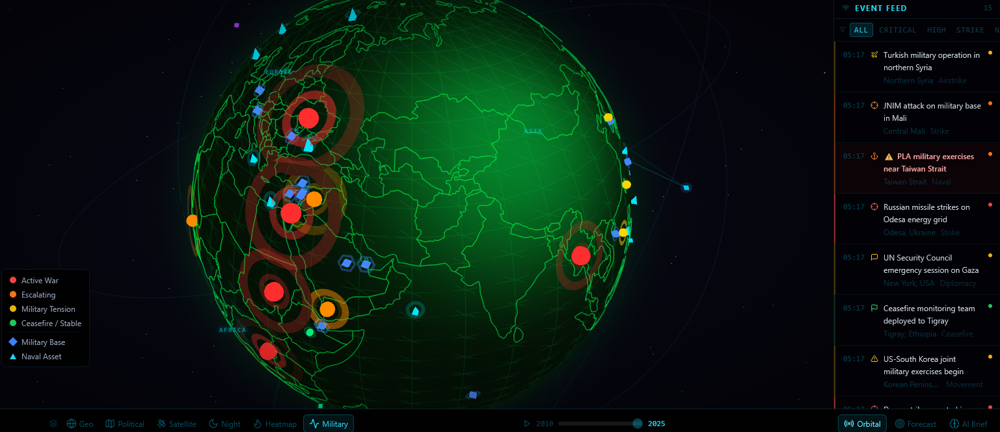
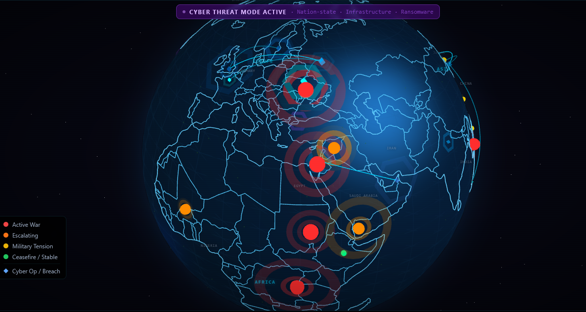
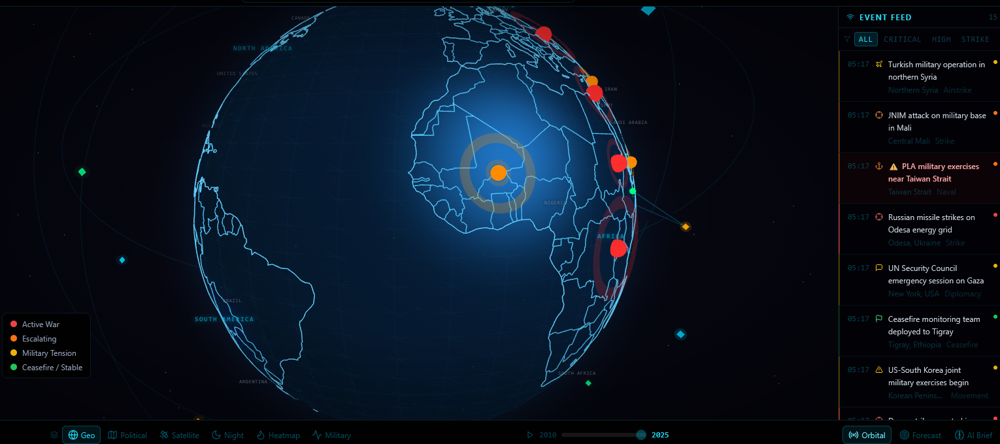

# Sentinel Globe 🌍

### Global Intelligence Platform

Sentinel Globe is an interactive intelligence visualization platform designed to monitor global instability, geopolitical conflicts, cyber threats, and strategic events in a unified command interface.

The platform combines **geopolitical monitoring, cyber intelligence overlays, predictive instability analytics, and satellite-style global visualization** to demonstrate how modern intelligence systems could monitor global activity.

Sentinel Globe explores how complex geopolitical and security data can be visualized through a **layered interactive globe, intelligence dashboards, and real-time event monitoring.**

---

# **Platform Overview**

Sentinel Globe provides a centralized monitoring system where users can explore:

- Global conflict zones
- Military tensions and armed conflicts
- Cyber threat activity
- Political instability signals
- Economic disruptions
- Humanitarian crisis regions
- Global strategic events

The platform integrates multiple intelligence layers into a single visualization environment.

---

# **Core Features**

### **Interactive Intelligence Globe**

A fully interactive global visualization displaying geopolitical activity, instability hotspots, and strategic event markers.

Users can rotate the globe and explore global regions experiencing instability or conflict.

---

### **Global Instability Engine**

Sentinel Globe includes a **Global Instability Engine (GIE)** that analyzes multiple global indicators to calculate a real-time instability score.

Indicators analyzed include:

- Military conflict activity
- Political instability
- Cyber attacks
- Economic disruptions
- Humanitarian crises

The system produces a **Global Instability Index** along with regional risk indicators.

---

### **Global Event Feed**

A real-time intelligence feed displays major global developments such as:

- Military operations
- Missile strikes
- Cyber incidents
- Diplomatic tensions
- Humanitarian emergencies

Events are synchronized with markers on the globe to provide visual context.

---

### **Layered Intelligence System**

Sentinel Globe allows users to toggle multiple intelligence layers to explore different types of global activity.

Available layers include:

**Military Layers**

- Military bases
- Naval assets
- Armed conflicts
- Escalating tensions

**Cyber Intelligence**

- Cyber attack indicators
- Infrastructure breaches
- Ransomware activity
- Nation-state cyber operations

**Political Indicators**

- Diplomatic crises
- Election instability
- Sanction zones
- Government unrest

**Economic Signals**

- Trade disruptions
- Energy instability
- Supply chain pressure
- Economic crisis indicators

**Humanitarian Indicators**

- Refugee movements
- Famine risk zones
- Disaster response regions
- Humanitarian crisis hotspots

Each layer dynamically updates the globe visualization.

---

### **Strategic Event Analytics**

The platform tracks event activity through historical charts and trend analysis.

Users can observe how geopolitical instability evolves across time.

---

### **Orbital Intelligence View**

Sentinel Globe includes a conceptual **Orbital Intelligence Mode** that simulates satellite monitoring coverage.

This layer visualizes:

- reconnaissance satellites
- global monitoring zones
- intelligence scanning activity

The feature demonstrates how satellite data could integrate into a global intelligence platform.

---

# **Example Use Cases**

Sentinel Globe can be used to explore scenarios such as:

- monitoring global geopolitical instability
- analyzing conflict escalation patterns
- visualizing cyber threat distribution
- observing humanitarian crises
- tracking military developments
- exploring global strategic risk patterns

The platform demonstrates how intelligence analysts could interact with complex global data through visual systems.

---

# **Technologies / Concepts**

Sentinel Globe demonstrates concepts used in modern intelligence platforms:

- geospatial data visualization
- interactive dashboards
- layered intelligence overlays
- predictive analytics concepts
- strategic risk modeling
- global monitoring systems

---

# **Screenshots**

**Global Intelligence Dashboard**

The primary Sentinel Globe command interface showing the interactive globe, instability indicators, and real-time event monitoring.

**Global Instability Engine**

The Global Instability Engine analyzes geopolitical, military, cyber, and economic signals to calculate a real-time global instability index.

**Military Intelligence Layer**

Displays global military infrastructure including bases, naval assets, and active conflict zones.

**Cyber Intelligence Layer**

Visualizes cyber activity including digital attack nodes, infrastructure breaches, and cyber operations.

**Orbital Intelligence View**

Simulated satellite monitoring layer representing reconnaissance coverage and orbital intelligence scanning across global regions.

---

# **Future Enhancements**

Planned improvements include:

- predictive conflict modeling
- cyber warfare visualization layers
- AI strategic intelligence briefs
- advanced geopolitical forecasting
- real-time intelligence data integration
- expanded satellite monitoring systems

---

# **Project Purpose**

This project explores how modern monitoring dashboards could evolve into **intelligence platforms capable of integrating geopolitical, cyber, and economic signals into a unified operational interface.**

Sentinel Globe is designed as a **concept platform for global intelligence visualization and strategic monitoring.**

---

# **Author**

Developed as part of an exploration into global intelligence visualization, cybersecurity awareness, and strategic monitoring systems.

---
